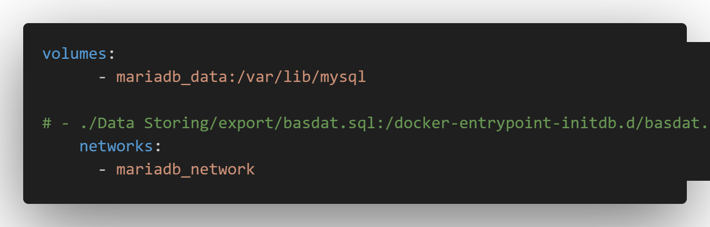

<h1 align="center">
   
  Seleksi Warga Basdat 2024  
  ETL Project
   
   
</h1>

<!-- CONTRIBUTOR -->

  <strong>
    <h3>Dibuat oleh :</h3>
    <table align="center">
        <tr>
            <td>NIM</td>
            <td>Nama</td>
        </tr>
        <tr>
            <td>Fedrianz Dharma</td>
            <td>13522090</td>
        </tr>
    </table>
  </strong>

## Table of Contents
* [General Info](#general-information)
* [Features](#features)
* [Requirements](#requirements)
* [Usage](#usage)
* [Automated Scheduling](#automated-scheduling)
* [Acknowledgements](#acknowledgements)
* [Links](#links)

## General Information
Pada project ini, saya akan melakukan *scraping* pada website [novelbin.me](https://novelbin.me/sort/novelbin-popular) untuk mendapatkan data-data dari novel yang ada pada website tersebut. Data-data yang didapatkan, akan diubah menjadi file JSON dan dimasukkan ke dalam database. Saya memilih topik ini karena saya suka membaca novel dan sering menggunakan website tersebut, selain itu data-data novel yang telah didapatkan dapat digunakan untuk melakukan analisis, misalnya perkembangan *trend* suatu *genre* dari tahun ke tahun.

## Features
- Web Scraper untuk [novelbin.me](https://novelbin.me/sort/novelbin-popular) (page 1-60) (takes about 30 minutes to scraped)
- Dashboard dengan [*Streamlit library*](https://docs.streamlit.io/)
- Automated Scheduling dengan `run.bat` dan *Task Scheduler*

## Requirements
1. Install Golang
2. Install Docker Desktop
3. pip install streamlit
4. pip install pandas
5. pip install mariadb
6. pip install numerize
7. pip install plotly
8. Masuk ke setiap folder yang mengandung go.mod dan jalankan `go mod tidy` dan `go mod download` (Data Scraping/src/main | Data Scraping/src/scraper | Data Storing/export)

## Usage
Pada docker-compose.yml, anda bisa meng-*uncomment* `./Data Storing/export/basdat.sql:/docker-entrypoint-initdb.d/basdat.sql` jika ingin langsung menggunakan file sql yang sudah tersedia dan memasukkannya ke dalam database pada *docker* (karena scrapingnya lama 30 menit)

Aktifkan docker dan eksekusi `docker compose up` pada root directory repository ini, kemudian: 
1. Masuk ke folder Data Scraping/src/main `cd "Data Scraping/src/main"`
2. Jalankan program `go run scraper.go` untuk menjalankan proses *scraping* (jumlah pages yang di *scrape* dapat diubah pada `scraper.go`) dan tunggu hingga program selesai. Program akan menghasilkan file JSON yang dimasukkan ke dalam folder dengan format YYYY-MM-DD yang merupakan tanggal *scraping* dilakukan dan terletak pada `Data Scraping/data` 
3. Pindah ke folder Data Storing/export `"cd ../../../Data Storing/export"` (relative to Data Scraping/src/main)
4. Jalankan program `go run dbms.go` untuk memasukkan data pada file JSON yang terletak pada folder `Data Scraping/data` ke database.
5. Pindah ke folder Data Visualization `cd "../../Data Visualization"` (relative to Data Storing/export)
6. Jalankan aplikasi *dashboard* dari data yang ada pada database `streamlit run streamlit_app.py`

Cara lain untuk menjalankan program dengan menggunakan `run.bat`:
1. Jalankan command `cmd /c run.bat` untuk menjalankan program *scraping* dan memasukkan data ke database
2. Tunggu hingga program selesai
3. Pindah ke folder Data Visualization `cd "Data Visualization"`
4. Jalan aplikasi *dashboard* dari data yang ada pada database `streamlit run streamlit_app.py`

## Automated Scheduling
Program dapat dijalankan secara otomatis dengan menggunakan *Task Scheduler* (Windows) untuk melakukan *scraping* dan *update* database secara berkala. Berikut adalah cara untuk men-*set up Task* tersebut: 
1. Masuk ke *Task Scheduler*
2. Pilih *Create task*
3. Masukkan nama dan deskripsi, lalu centang `run with highest priviledges`, lalu pilih `configure for windows 10`
4. Pindah ke `tab trigger`, klik `new`, lalu pilih Daily dan pilih jam untuk menjalankan *task* setiap harinya
5. Pindah ke `tab action`, klik `new`, klik `browse` dan pilih `run.bat` 
6. Pindah ke `tab settings`, centang `run task as soon as possible after a scheduled task is missed` dan `if the task fail, restart every`
7. Lalu klik Ok
8. Program akan berjalan secara otomatis pada waktu yang ditentukan setiap hari. Jika PC mati pada waktu untuk melakukan *task*, maka *task* akan dimulai saat PC menyala. (not always worked)

Setelah selesai melakukan *set up*, proses *scraping* akan dijalankan setiap harinya pada jam yang telah ditentukan. File JSON hasil *scraping* akan berada di `Data Scraping/data/YYYY-MM-DD`. YYYY-MM-DD akan sesuai dengan tanggal dilakukannya *scraping*. Proses *scheduling* ini juga otomatis akan memasukkan file JSON ke dalam database dan meng-*export* database ke file sql. Proses ini dapat diubah dengan mengedit file `run.bat`.  

## JSON File
File file JSON hasil *scraping* akan disimpan pada sebuah folder yang diberi nama tanggal dilakukannya *scraping* dengan format YYYY-MM-DD. Folder tersebut akan diletakkan pada `Data Scraping/data`
- `AlternativeNames.json`  
  File JSON ini berisi *list* dari sebuah JSON Object yang merepresentasikan Alternative Names dari sebuah series/novel. JSON Object tersebut mempunyai *field* **seriesName dan altName**
- `AlternativeNamesMap.json`  
  File JSON ini berisi *mapping* dari **seriesName dan altName** dengan *boolean* agar *entry* pada `AlternativeNames.json` tidak ada yang duplikat
- `Folder Chapter` 
  Folder ini berisi beberapa file JSON `Chapter_Release x.json`. Tiap file tersebut berisi *list* dari sebuah JSON Object yang merepresentasikan Chapter_Release dari setiap series/novel yang di *scraped*. Setiap series/novel dibatasi 50 *entry* pada Chapter_Release karena alasan ukuran (Github track file max 100MB)
- `Chapter_ReleaseMap.json` 
  File JSON ini berisi *mapping* dari **seriesName dan chapter** dengan *boolean* agar *entry* pada `Chapter_Release x.json` tidak ada yang duplikat
- `Genres.json`  
  File JSON ini berisi *list* JSON Object yang merepresentasikan **Genre** yang ada dari semua series/novel yang telah di *scraped*
- `GenreMap.json` 
  File JSON ini berisi *mapping* dari **genre** dengan *boolean* agar *entry* pada `Genres.json` tidak ada yang duplikat
- `GenreNovel.json` 
  File JSON ini berisi *list* JSON Object yang merepresentasikan pasangan **seriesName dengan genre-nya**
- `GenreNovelMap` 
  File JSON ini berisi *mapping* dari **seriesName dan genre** dengan *boolean* agar *entry* pada `GenreNoveljson` tidak ada yang duplikat
- `Tags.json`  
  File JSON ini berisi *list* JSON Object yang merepresentasikan **Tag** yang ada dari semua series/novel yang telah di *scraped*
- `TagsMap.json` 
  File JSON ini berisi *mapping* dari **tag** dengan ***boolean*** agar *entry* pada `Tags.json` tidak ada yang duplikat
- `TagNovel.json` 
  File JSON ini berisi *list* JSON Object yang merepresentasikan pasangan **seriesName dengan tag-nya**
- `TagNovelMap` 
  File JSON ini berisi *mapping* dari **seriesName dan tag** dengan *boolean* agar *entry* pada `TagNovel.json` tidak ada yang duplikat
- `Series.json` 
  File JSON ini berisi *list* dari JSON Object yang merepresentasikan **series/novel**. JSON Object ini memiliki 11 *field*, yaitu **seriesName, rating, ratingCount, author, year, publisher, total_chapter, description, link, dan last_update.**
- `NovelsMap.json` 
  File JSON ini berisi *mapping* dari seriesName dengan *boolean* agar *entry* pada `Series.json` tidak ada yang duplikat

## Entity Relationship Diagram

- Entity Series merepresentasikan series/novel yang akan di *scraped*. Entity Series memiliki atribut total_chapter karena pada Chapter_Release hanya akan menampung 50 chapter pertama dari setiap series/novel (file size issue)
- Entity Genres merepresentasikan genre-genre yang ada pada novel yang di *scraped*
- Entity Tags merepresentasikan tag-tag yang ada pada novel yang di *scraped*
- Weak Entity Chapter_Release merepresentasikan chapter-chapter dari setiap novel
- Entity Groups merepresentasikan group translator yang menerjemahkan chapter-chapter pada Chapter_Release
- Entity Recommendation_List merepresentasikan *Recommendation List* yang ada dibuat oleh pengguna
- Relasi Series_Genre merepresentasikan hubungan antara series dengan genre-genre yang dimilikinya
- Relasi Series_Tag merepresentasikan hubungan antara series dengan tag-tag yang dimilikinya
- Relasi Recommendation merepresentasikan hubungan antara suatu series dengan series yang direkomendasikan jika menyukai series tersebut. Relasi ini juga memiliki atribut jumlah yang akan menyimpan jumlah orang yang merekomendasikan suatu series jika menyukai suatu series.
- Relasi Related_Series merepresentasikan hubungan antara suatu series dengan series lain yang saling terkait, misalnya Book 1 dan Book 2 atau berada dalam 1 universe (Contohnya Harry Potter atau komik-komik Marvel)
- Relasi Group_Release merepresentasikan hubungan antara translator group dengan chapter dari suatu series yang ditranslatenya (asumsi setiap chapter hanya memiliki satu translator group)
## Relational Diagram

## Translasi ERD to Relational Diagram
1. Translasi ERD ke Relational Diagram dimulai dengan mengubah semua entity menjadi tabel pada Relational Diagram. 

2. Kemudian pada Entity Series terdapat atribut yang multivalued, atribut tersebut akan dibuat menjadi tabel tersendiri pada Relational Diagram. Primary Key dari tabel tersebut adalah seriesName dan alternative name. Relasi Recommendation memiliki atribut relasi sehingga tabel yang terbentuk juga akan memiliki atribut tambahan tersebut.

3. Weak Entity Chapter_Release akan memiliki tambahan Primary Key dari Entity yang terhubung dengannya. 

4. Kemudian ubah relasi-relasi pada ERD yang many-to-many menjadi tabel tersendiri pada Relational Diagram, seperti Series_Tag, Series_Genre, Recommendation, Related_Series, Rec_Series, dan Rec_Tag. Tabel-tabel tersebut akan memiliki Primary Key yang merupakan gabungan dari Primary Key kedua tabel yang dihubungkannya.

5. Relasi Series_Chap merupakan relasi dengan Weak Entity sehingga relasi tersebut tidak diubah menjadi tabel. 

6. Relasi Group_Release merupakan relasi one-to-many, namun total participation berada pada sisi yang *one* sehingga relasi tersebut juga diubah menjadi tabel tersendiri pada Relational Diagram. Primary Key dari tabel tersebut merupakan gabungan dari Primary Key kedua tabel yang dihubungkannya.

## Screenshot

## Acknowledgements
- This project was based on [Seleksi Warga Basdat 2024 ETL Project](https://docs.google.com/document/d/1Mi0OJNlCIp6ky1uDF-xzhgE-yos3b0ThI24Gvde70gM/edit).

## Links
- [Link to The Scraped Website](https://novelbin.me/sort/novelbin-popular) (page 1-60)
- [Link to Streamlit documentation](https://docs.streamlit.io/) 
- [Link to Plotly documentation](https://plotly.com/python/)
- [Link to Go Colly github](https://github.com/gocolly/colly)
- [Link to Go Colly documentation](https://pkg.go.dev/github.com/gocolly/colly/v2)
- [Link to Go Language Website](https://go.dev/)